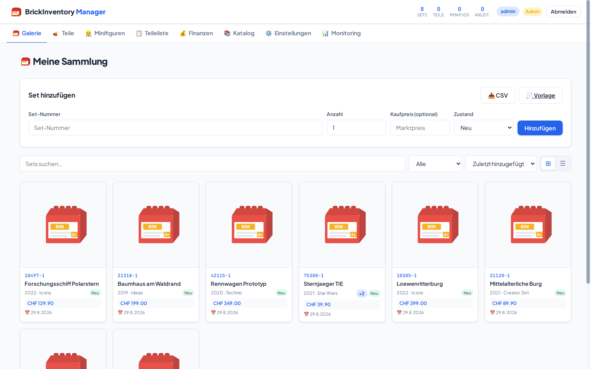
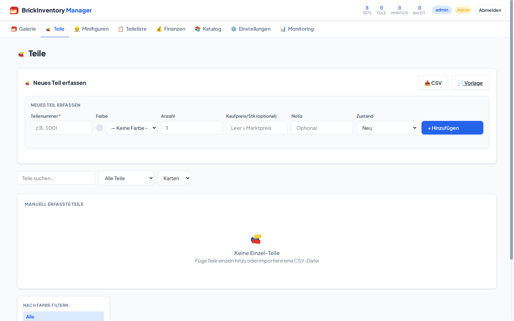
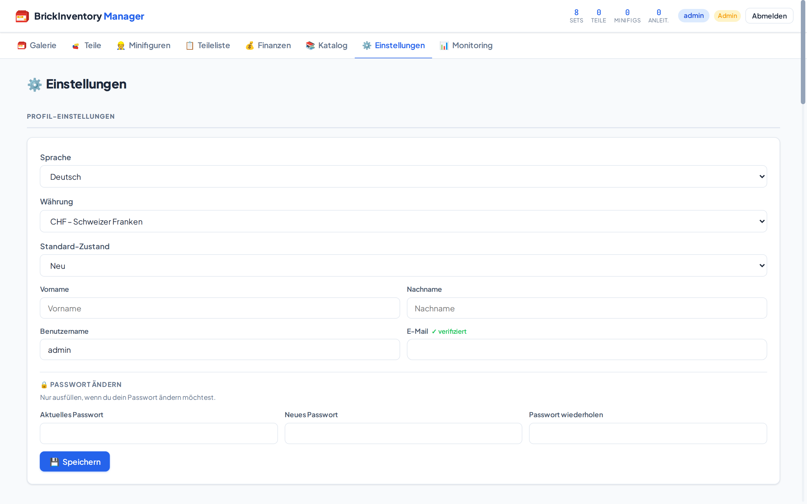
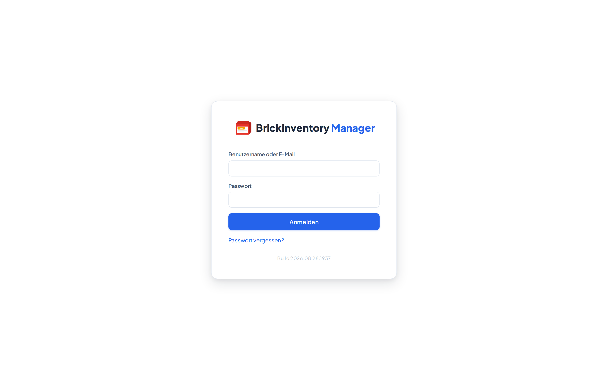

<div align="center">


# BrickInventory Manager

**Selbstgehostete Verwaltung für Klemmbaustein-Sammlungen** — Web-Oberfläche,
Android-App und ein gemeinsamer Server.

Sets erfassen, Teile und Minifiguren im Blick behalten, Marktwerte über
BrickLink verfolgen, Anleitungen automatisch von Brickset holen.

[](https://github.com/addict85/BrickInventory/actions/workflows/android.yml)
[](https://github.com/addict85/BrickInventory/actions/workflows/docker-publish.yml)

</div>

---

## Die Oberfläche



*Die Sammlung: suchen, filtern, sortieren. Sets einzeln oder per CSV anlegen,
je mit Anzahl, Kaufpreis und Zustand.*

<table>
<tr>
<td width="50%"></td>
<td width="50%"></td>
</tr>
<tr>
<td><b>Teile</b> — einzeln erfassen oder aus Sets übernehmen, nach Farbe filtern.</td>
<td><b>Einstellungen</b> — Sprache, Währung, Zustand, API-Schlüssel, Haushalt.</td>
</tr>
</table>

<details>
<summary>Anmeldung</summary>



</details>

> Die Aufnahmen zeigen einen Demo-Bestand auf einer frisch aufgesetzten
> Installation. Die Bilder der Sets sind der eingebaute Platzhalter — auf einer
> Installation mit hinterlegten API-Schlüsseln stehen dort die echten
> Set-Abbildungen. Die Ansicht **Finanzen** fehlt bewusst: Ohne
> BrickLink-Zugangsdaten zeigt sie nur leere Marktpreise und wäre als
> Aushängeschild irreführend.

---

## Was drin ist

| | |
| --- | --- |
| **Galerie** | Sets anlegen (einzeln, per CSV oder Barcode), suchen, filtern, verschieben |
| **Teile & Minifiguren** | aus Sets übernommen oder manuell erfasst, nach Farbe und Herkunft filterbar |
| **Finanzen** | Portfolio-Wert über BrickLink-Preise, Kaufpreis gegen Marktwert, Verlauf |
| **Katalog** | Set-Suche über Rebrickable, mit Jahres-Regler |
| **Anleitungen** | automatisch von Brickset geholt, eigene PDFs hochladbar |
| **Haushalt** | mehrere Konten mit gemeinsamem Blickfeld (Eltern sehen die Sammlungen der Kinder) |
| **Mehrsprachig** | Deutsch und Englisch, Währung frei wählbar |

---

## Schnellstart

Der einfachste Weg ist Docker. Postgres kommt mit.

```bash
git clone https://github.com/addict85/BrickInventory.git
cd BrickInventory/Web-App
# SESSION_SECRET in compose.yaml auf einen eigenen Zufallswert setzen:
#   openssl rand -base64 48
docker compose up -d
```

→ <http://localhost:3000>

Das Passwort des Kontos `admin` wird beim allerersten Start **einmalig ins
Log** geschrieben (`docker compose logs app`) — oder vorab über
`ADMIN_PASSWORD` gesetzt.

### Auf dem Raspberry Pi

Das Image wird als Multi-Arch-Manifest veröffentlicht, `docker` wählt die
passende Architektur selbst:

| Plattform | deckt ab |
| --- | --- |
| `linux/amd64` | PC, Server, NAS, jede x86-Cloud |
| `linux/arm64` | Raspberry Pi 3/4/5 und Zero 2 W (**64-Bit-System**), Apple Silicon, ARM-Server |

```bash
docker compose pull && docker compose up -d
```

32-Bit (`armv7`) wird nicht unterstützt — Details und Begründung in
[`Web-App/README.md`](Web-App/README.md).

---

## Die Android-App


Kotlin und Jetpack Compose, `minSdk 26`, `compileSdk`/`targetSdk` 36.
Spricht ausschliesslich über `/api/v1/` mit Bearer-Token — die
Token-Verwaltung liegt in der Weboberfläche unter *Einstellungen → Mobile API*.
Anmeldung wahlweise über QR-Code aus der Web-Oberfläche.

<br clear="left">

Barcode- und Texterkennung für das Erfassen unterwegs, Galerie, Teileliste,
Finanzen und PDF-Export der Anleitungen.

> **Screenshots der App fehlen hier noch.** Sie lassen sich nur auf einem Gerät
> oder Emulator aufnehmen; in der Umgebung, in der dieses README entstanden
> ist, war beides nicht verfügbar. Zum Ergänzen: Aufnahmen nach
> `docs/screenshots/` legen (z. B. `android-galerie.png`) und hier einbinden.

Bauen:

```bash
cd Android-App
./gradlew assembleRelease      # → app/build/outputs/apk/release/
```

Fertige APKs hängen als Artefakt an jedem
[Android-Workflow-Lauf](https://github.com/addict85/BrickInventory/actions/workflows/android.yml).
Signiert wird, wenn die vier Keystore-Secrets hinterlegt sind — sonst entsteht
ein unsigniertes APK, das sich nicht installieren lässt. Siehe
[`Android-App/README.md`](Android-App/README.md).

---

## Aufbau

```
Web-App/       Node.js + TypeScript + Express, PostgreSQL, Docker
Android-App/   Kotlin + Jetpack Compose, Hilt, Retrofit, CameraX + ML Kit
```

| | Web-App | Android-App |
| --- | --- | --- |
| Sprache | TypeScript (~24 700 Zeilen) | Kotlin (78 Dateien) |
| Tests | 119 Testdateien, 785 Prüfungen | 58 Testdateien, 289 Prüfungen |
| Laufzeit | Node 26, PostgreSQL 18 | Android 8.0+ (API 26) |

Beide Bäume tragen eine ausführliche Änderungshistorie mit Begründungen:
[`Web-App/CHANGELOG-fixes.md`](Web-App/CHANGELOG-fixes.md) und
[`Android-App/CHANGELOG-fixes.md`](Android-App/CHANGELOG-fixes.md). Die
Invarianten der App stehen in
[`Android-App/INVARIANTEN.md`](Android-App/INVARIANTEN.md).

---

## Entwickeln

```bash
# Web-App
cd Web-App && npm ci
npm run build
TEST_DATABASE_URL=postgres://…  REQUIRE_DB=1  npm test

# Android-App
cd Android-App && ./gradlew testDebugUnitTest
```

`REQUIRE_DB=1` ist nicht optional: Ohne die Variable überspringen die
Datenbank-Suiten sich selbst, und der Lauf ist grün, ohne die Hälfte geprüft
zu haben.

Ausführliche Anleitungen: [`Web-App/README.md`](Web-App/README.md) ·
[`Android-App/README.md`](Android-App/README.md)
